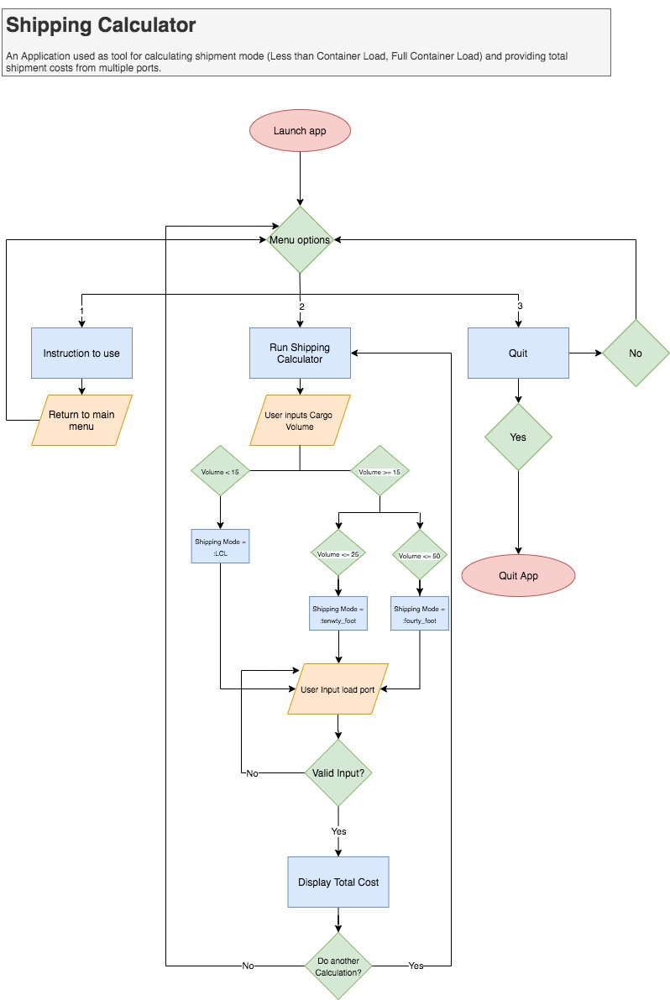
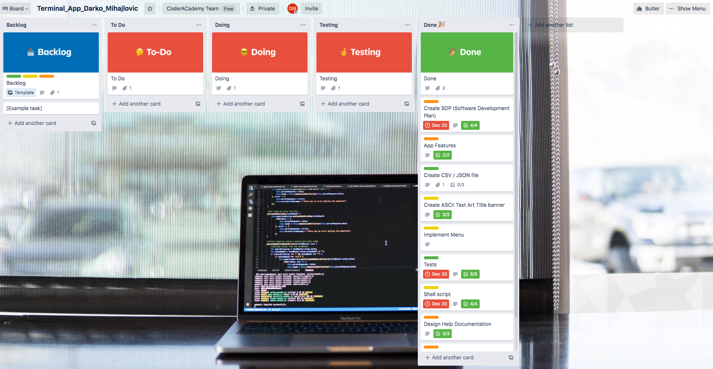
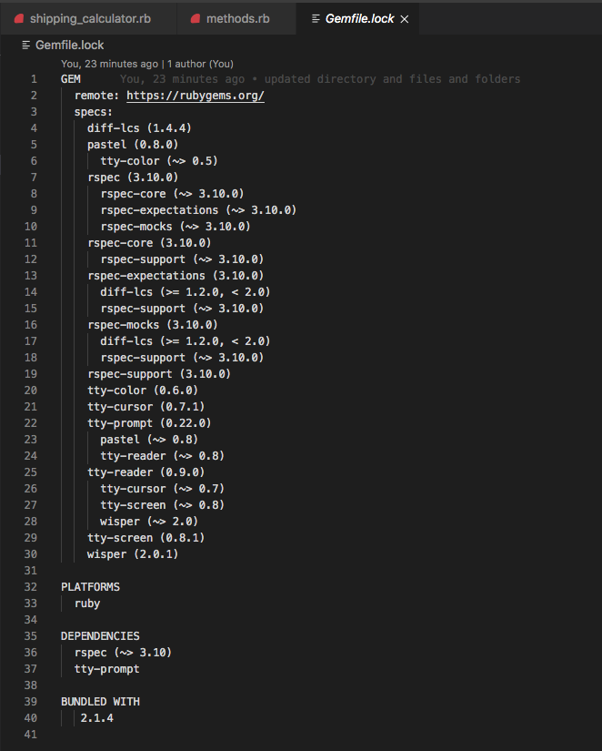

# Shipping Calculator (T1A3_Darko_Mihajlovic)

## Source Control Repository 

[GitHub Repository](https://github.com/DarkoAU/ruby_terminal_app_T1A3)

## Software Development Plan (SDP)

This application is designed to assist importers in choosing most cost effective shipping options based on cargo volume and provide them with the total freight costs for the shipment based on the amount of cargo / full container loads applicable. 

Once run, the main menu will display 3 options: 

  - Instructions
  - Run Shipping Calculator
  - Quit

The “Instructions” submenu will provide users with detailed information on how to run the calculator, and also what load ports are supported. 

Under the “Run Shipping Calculator” option, the application will accept user input for cargo volume and will store it under in a hash under the applicable key. 

Users will then be prompted to enter a loading port, which should be one of the supported ports, as per the instructions manual. 
The load port information is stored in a .csv file and the application will try to find the load port user input in the .csv file and display the applicable values for that particular port. 

Once all these details are obtained, the Application will calculate the total shipping costs based on the cargo volume and the shipping mode costs for the selected port. 

This Application has been designed to address real world problems found in the shipping industry, where importers are often unaware of the most effective modes for shipping their goods, which often results in choosing the least competitive mode for shipping their goods and unnecessarily paying additional fees. 
To overcome these real life issues, this Application will suggest the most competitive shipping mode to the user based on the cargo volume, and will then provide them with real-time total freight costs for the consignment from the selected load port. 

The target audience for this Application are existing Importers based in Melbourne, or other parties interested in shipping and sourcing rates from the supported load ports, as well as the educators are [Coder Academy AU](https://coderacademy.edu.au/) who will be reviewing and marking this Application as part of our Term 1 Terminal App assignment. 

This Application will be launched and used from the Command Line, by running the shell script file **`./shipping_calculator.sh`**, or by calling **`ruby shipping_calculator.rb`** from the file directory. 

## Features

  1. Instructions 

The instructions menu will provide users with clear information on how to use the tool. 
This includes adding the cargo volume and also suggesting what type of mode is applicable for the shipment size. 
Within the instructions is also a list of all supported origin ports that can be used with this Application. 

  2. Cargo Input 

Under the “Run Shipping Calculator” option, the application will accept user input for cargo volume and will store it under in a hash under the applicable key. This Hash is initiated with 3 keys, whose values are initially set to 0: 

  - :LCL => 0
  - :twenty_foot => 0
  - :fourty_foot => 0

Depending on the cargo volume input, certain keys will be populated, and remaining keys with a value of zero will then be deleted. 
This will then finalize the first step of the shipping calculation and display the suggested shipping mode, which is interpolated from the hash containing the appropriate value for this specific calculation instance. 

  3. Load Port Input 

Under this feature, the user will be requested to input their Load Port, based on the available supported ports provided in the “Instructions” menu. 
If the Load Port input is invalid, a rescue message is outputted to prompt the user that the Load Port is incorrect, and the retry keyword will execute the rescue block again, allowing the user to try entering the Load Port again. 
Once a valid input is added, the valid Load Port information will be found in the .csv file and the system will output the different pricing for each shipping mode. 

  4. Calculate Total Costs 

With the container mode established, we have a hash that stores the correct mode, and by finding the correct Load Port in the .csv file, the Application now has all required parameters to calculate the total shipping cost. 
A third calculation method will use the previous two methods / features as arguments, multiply the applicable shipping mode with the corresponding costs and display the total freight cost to the user, based on the cargo volume. 
On completion, the user will be asked if they wish to do another calculation and based on the response, the Application will either loop through the calculation or return to the main menu. 

## User Interaction 

The user can find information and instructions on how to interact with this Application from the Help section below. 
Once the Application is run on the terminal, the user will have access to the main menu, which will allow them to select the desired action by using the up/down arrow keys on the keyboard and pressing enter. 
The application will ask for valid input, and where applicable, an incorrect user input will be handled by rescue messages and the user will be prompted to correct their input. 

## Control Flow Diagram 

## Implementation Plan

This project was managed using the following [Trello Board](https://trello.com/b/N8q15uPD/terminalappdarkomihajlovic). 
I have used color-coded cards to split the development of different tasks and features, and assigned the following three labels: 

  - MVP Functionality 
  - ADD-ON Improvements 
  - Documentation 

## Help Documentation 

This Application will require Ruby version 2.7.0 or higher. 

The following dependencies are required to be installed in order to run this application, and the automated dependencies are available in the gemfile.lock, as per below screenshot: 

  - Rspec
  - TTY:Prompt

To run the Application, users will have to: 

  - Download the source code
  - Open their terminal / terminal emulator
  - Install Bundles by running **`gem install bundler`**
  - Install all dependencies by running **`gem install`** from the corresponding directory. 
  - From the corresponding directory run **`ruby shipping_calculator.rb`** 
  - Or from the corresponding directory, run the Application using the shell script command **`./shipping_calculator.sh`**. 
  - Once the Application is running, the user will have access to the main menu where they can access instruction on how to use the shipping calculator. 

